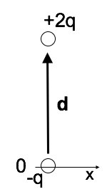

<section data-markdown>

The general solution for the electric potential in spherical coordinates with azimuthal symmetry (no $\phi$ dependence) is:

$$V(r,\theta) = \sum_{l=0}^{\infty} \left(A_l r^l + \dfrac{B_l}{r^{l+1}}\right)P_l(\cos \theta)$$

Consider a metal sphere (constant potential in and on the sphere, remember). Which terms in the sum vanish outside the sphere? (Recall: $V \rightarrow 0$ as $r \rightarrow \infty$)

1. All the $A_l$'s
2. All the $A_l$'s except $A_0$
3. All the $B_l$'s
4. All the $B_l$'s except $B_0$
5. Something else

Note:
* CORRECT ANSWER: E
* Only B0 will survive.

</section>

<section data-markdown>

$$\mathbf{p} = \sum_i q_i \mathbf{r}_i$$

What is the dipole moment of this system?

(BTW, it is NOT overall neutral!)

1. $q\mathbf{d}$
2. $2q\mathbf{d}$
3. $\frac{3}{2}q\mathbf{d}$
4. $3q\mathbf{d}$
5. Someting else (or not defined)

Note:
* CORRECT ANSWER: B

</section>

<section data-markdown>

Which charge distributions below produce a potential that looks like $\frac{C}{r^2}$ when you are far away?

E) None of these, or more than one of these!

(For any which you did not select, how DO they behave at large r?)

Note:
* CORRECT ANSWER: E (Both C and D)

</section>
