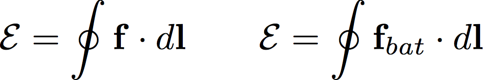
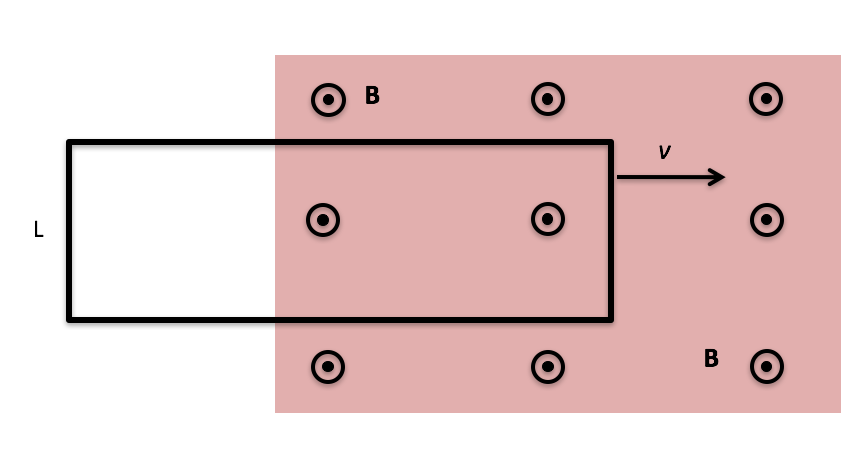
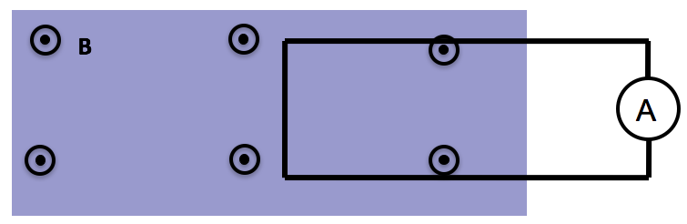
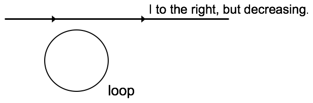
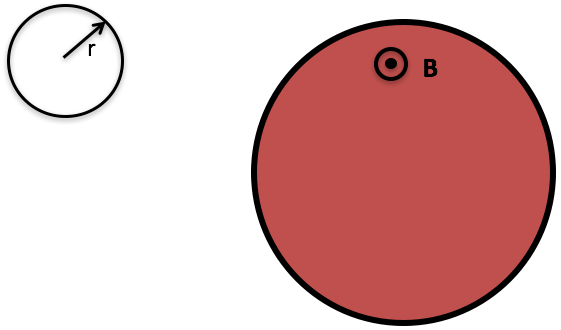

<section data-markdown>

Recall the machined copper from last class, with steady current flowing left to right through it

In the "necking down region" (somewhere in a small-ish region around the head of the arrow), do you think

1. $\nabla \cdot \mathbf{E} = 0$
2. $\nabla \cdot \mathbf{E} \neq 0$

Note:
* Correct Answer: A

</section>

<section data-markdown>

Recall the machined copper from last class, with steady current flowing left to right through it

In steady state, do you expect there will be any surface charge accumulated anywhere on the walls of the conductor?

1. Yes
2. No

Note:
* Correct Answer: A

</section>

<section data-markdown>

Quiz #1 was a fair assessment.

1. Strongly Agree
2. Agree
3. Neutral
4. Disagree
5. Strongly Disagree

</section>

<section data-markdown>

I had enough time to complete Quiz #1.

1. Strongly Agree
2. Agree
3. Neutral
4. Disagree
5. Strongly Disagree

</section>

<section data-markdown>

## Announcements

* Quiz #1 is graded. Average: 83%
  * Would you like emailed grade reports after each quiz?
* Homework 3 is posted; Due Monday Jan 30th
  * Turn in to Kim Crosslan by 4pm
* **No Class on Monday, Jan 30**  - DC out of town
  * Will be available by text and email
  * Homework 4 will be posted

</section>

<section data-markdown>

$\mathcal{E} = \oint \mathbf{E} \cdot d\mathbf{l}$

EMF ($\mathcal{E}$) is the line integral of the total force per unit charge around a closed loop.
The units of EMF are:   

1. Farads
2. Joules
3. Amps, (that’s why current flows.)
4. Newtons, (that’s why it’s called emf)
5. Volts

Note:
* Correct Answer: E

</section>

<section data-markdown>

Imagine a charge $q$ able to move around a tube which makes a closed loop. If we want to drive the charge around the loop, we **cannot** do this with E-field from a single stationary charge.

Can we drive the charge around the loop with some combination of stationary + and – charges?

1. Yes
2. No

Note:
* Correct Answer: B

</section>

<section data-markdown>

A circuit with a battery with voltage difference $\Delta V$ is attached to a resistor.  The force per charge due to the charges is $\mathbf{E}$.  The force per charge inside the battery is $\mathbf{f} = \mathbf{f}_{bat}  + \mathbf{E}$.

How many of the following statements are true?

A. 0 B. 1 C. 2 D. 3 E. 4

Note:
* Correct Answer: D

</section>

<section data-markdown>

One end of rectangular metal loop enters a region of constant uniform magnetic field $\mathbf{B}$, with initial constant speed $v$, as shown.  What direction is the magnetic force on the loop?

1. Up the "screen" $\uparrow$
2. Down the "screen" $\downarrow$
3. To the right $\rightarrow$
4. To the left $\leftarrow$
5. The net force is zero

Note:
* Correct Answer: D
</section>

<section data-markdown>

One end of rectangular metal loop enters a region of constant uniform magnetic field $\mathbf{B}$, out of page, with constant speed $v$, as shown. As the loop enters the field is there a non-zero emf around the loop?

1. Yes, current will flow CW
2. Yes, current will flow CCW
3. No

Note:
* Correct Answer: A

</section>

<section data-markdown>

A rectangular metal loop moves through a region of constant uniform magnetic field $\mathbf{B}$, with speed $v$ at $t = 0$, as shown.  What is the magnetic force on the loop at the instant shown? Assume the loop has resistance $R$.

1. $2L^2 vB^2/R$ (right)
2. $2L^2 vB^2/R$  (left)
3. 0           
4. Something else/not sure...

Note:
* Correct Answer: C
</section>

<section data-markdown>

Consider two situations: 

1) Loop moves to right with speed $\lvert v\rvert$ 

2) Magnet moves to left with (same) speed $\lvert v\rvert$ 

What will the ammeter read in each case? (Assume that CCW current => positive ammeter reading)

1. $I_1$>0, $I_2$=0
2. $I_1$= $I_2$ > 0
3. $I_1$= -$I_2$ > 0
4. $I_1$= $I_2$ = 0
5. Something different/not sure

</section>

<section data-markdown>

Faraday found that EMF is proportional to the negative time rate of change of B. EMF is also the line integral of a **force/charge**. The force is $\mathbf{f}_q$ in the expression:

$$\mathcal{E} = \oint \mathbf{f}_q \cdot d\mathbf{l}$$

That force is:

1. the magnetic Lorentz force.
2. an electric force.
3. the strong nuclear force.
4. the gravitational force.
5. an entirely new force.

Note:
* Correct Answer: B, but there's a subtlety here; could E (special relativity)

</section>

<section data-markdown>

A stationary rectangular metal loop is in a region of uniform magnetic field $\mathbf{B}$, which has magnitude B decreasing with time as $B=B_0-kt$. What is the direction of the field induced B-field created by the induced current in the loop, in the plane region inside the loop?

1. Into the screen
2. Out of the screen
3. To the left
4. To the right
5. other/??

Note:
* Correct Answer: B

</section>

<section data-markdown>

A rectangular metal loop is moving thru a region of constant uniform magnetic field $\mathbf{B}$, out of page, with constant speed $v$, as shown. Is there a non-zero emf around the loop?

1. Yes, current will flow CW
2. Yes, current will flow CCW
3. No

Note:
* Correct Answer: C

</section>

<section data-markdown>

A loop of wire is near a long straight wire which is carrying a large current $I$, which is **decreasing**.  The loop and the straight wire are in the same plane and are positioned as shown.  The current induced in the loop is:

1. counter-clockwise
2. clockwise
3. zero.

Note:
* Correct Answer: B

</section>

<section data-markdown>

The current in an infinite solenoid with uniform magnetic field $\mathbf{B}$ inside is increasing so that the magnitude $B$ in increasing with time as $B=B_0+kt$. A small circular loop of radius $r$ is placed NON-coaxially inside the solenoid as shown.

What is the emf around the small loop?
(Assume CW is the direction of $dl$ in the EMF loop integration)

1. $k\pi r^2$
2. $-k\pi r^2$
3. Zero
4. Nonzero, but need more information for value
5. Not enough information to tell if zero or non-zero

Note:
* Correct Answer: A

</section>

<section data-markdown>

The current in an infinite solenoid with uniform magnetic field $\mathbf{B}$ inside is increasing so that the magnitude $B$ in increasing with time as $B=B_0+kt$. A small circular loop of radius $r$ is placed outside the solenoid as shown.  

What is the emf around the small loop? (Assume CW is the positive direction of current flow).

1. $k\pi r^2$
2. $-k\pi r^2$
3. Zero
4. Nonzero, but need more information for value
5. Not enough information to tell if zero or non-zero

Note:
* Correct Answer: C

</section>

<section data-markdown>

The current in an infinite solenoid of radius $R$ with uniform magnetic field $\mathbf{B}$ inside is increasing so that the magnitude $B$ in increasing with time as $B=B_0+kt$.  If I calculate $V$ along path 1 and path 2 between points A and B, do I get the same answer?

1. Yes
2. No
3. Need more information

Note:
* Correct Answer: A
</section>

<section data-markdown>

The current in an infinite solenoid with uniform magnetic field $\mathbf{B}$ inside is increasing so that the magnitude $B$ in increasing with time as $B=B_0+kt$. A small circular loop of radius $r$ is placed coaxially inside the solenoid as shown.  Without calculating anything, determine the direction of the induced magnetic field created by the induced current in the loop, in the plane region inside the loop?

1. Into the screen
2. Out of the screen
3. CW
4. CCW
5. Not enough information

Note:
* Correct Answer: A
</section>
