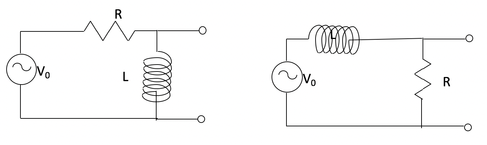

<section data-markdown>

What is $(1+i)^2/(1-i)$?

1. $e^{i\pi/4}$
2. $\sqrt{2}e^{i\pi/4}$
3. $e^{i3\pi/4}$
4. $\sqrt{2}e^{i3\pi/4}$
5. Something else!

Note:
*Correct Answer: D
</section>

<section data-markdown>

## Announcements
* Project problems are graded
  * Sync your repositories to receive feedback
  * Responding to your feedback is a big part of the next project problem
* Quiz 3 (next Friday 2/17) - RLC circuits
  * Solve a circuit problem using the phasor method
  * Discuss limits on the response and how it might act as a filter

</section>

<section data-markdown>

For the RL circuit with driving voltage of $V(t) = V_0 \cos (\omega t)$, we found a solution for the current as a function of time, with $I=0$ at $t=0$,

$$I(t) = a \cos(\omega t + \phi) - a\cos(\phi) e^{-Rt/L}$$

where $a = \frac{V_0}{\sqrt{R^2+L^2\omega^2}}$ and $\phi = \tan^{-1}(-L\omega/R)$. What happens to the current when $\omega \rightarrow \infty$?

1. Current is essentially zero, for all time
2. Current dies off completely, eventually goes to zero
3. Eventually, current is constant, $V_0/R$
4. It depends
5. ???

</section>

<section data-markdown>

For the RL circuit with driving voltage of $V(t) = V_0 \cos (\omega t)$, we found a solution for the current as a function of time, with $I=0$ at $t=0$,

$$I(t) = a \cos(\omega t + \phi) - a\cos(\phi) e^{-Rt/L}$$

where $a = \frac{V_0}{\sqrt{R^2+L^2\omega^2}}$ and $\phi = \tan^{-1}(-L\omega/R)$. What happens to the current when $\omega \rightarrow \infty$?

1. Current is essentially zero, for all time
2. Current dies off completely, eventually goes to zero
3. Eventually, current is constant, $V_0/R$
4. It depends
5. ???

</section>

<section data-markdown>

Which point below best represents $4e^{i3\pi/4}$ on the complex plane?

Note:
* Correct Answer: D

</section>

<section data-markdown>

What is the total impedance of this circuit, $Z_{total}$?

1. $R + i\left(\omega L + \frac{1}{\omega C}\right)$
2. $R + i\left(\omega L - \frac{1}{\omega C}\right)$
3. $\frac{1}{R} + \frac{1}{i\omega L} + {i \omega C}$
4.  $\dfrac{1}{\frac{1}{R} + \frac{1}{i\omega L} + {i \omega C}}$
5. None of these

Note:
* Correct Answer: B

</section>

<section data-markdown>

What is $Re\left[\frac{e^{i\omega t}}{1+i}\right]$?

1. $\frac{1}{\sqrt{2}}\cos(\omega t + \pi/4)$
2. $\frac{1}{\sqrt{2}}\cos(\omega t - \pi/4)$
3. $\frac{1}{{2}}\cos(\omega t + \pi/4)$
4. $\frac{1}{{2}}\cos(\omega t - \pi/4)$
5. Something else

Note:
* Correct Answer: B

</section>

<section data-markdown>

AC voltage $V$ and current $I$ vs time $t$ are as shown:

The graph shows that..

1. $I$ leads $V$  ( $I$ peaks before $V$ peaks )
2. $I$ lags $V$    ( $I$ peaks after $V$ peaks )
3. Neither

Note:
* Correct Answer: B

</section>

<section data-markdown>
Suppose you have a circuit driven by a voltage:
$$V(t)=V_0\cos(\omega t)$$

You observe the resulting current is:
$$I(t) = I_0\cos(\omega t-\pi/4)$$

Would you say the current is

1. leading
2. lagging

the voltage by 45 degrees?

Note:
* Correct Answer: B
</section>

<section data-markdown>
Two LR circuits driven by an AC power supply are shown below.

Which circuit is a low pass filter?

1. The left circuit
2. The right circuit
3. Both circuits
4. Neither circuit

Note:
* Correct Answer: B

</section>

<section data-markdown>
Two RC circuits driven by an AC power supply are shown below.

Which circuit is a high pass filter?

1. The left circuit
2. The right circuit
3. Both circuits
4. Neither circuit

Note:
* Correct Answer: A

</section>
