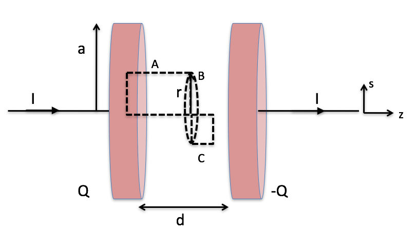

<section data-markdown>

Ampere's Law relates the line integral of B around some closed path, to a current flowing through a surface bounded by the chosen closed path.

$\oint \mathbf{B} \cdot d\mathbf{l} =  \mu_0 I$

By calling it a "Law", we expect that:

1. It is neither correct nor useful.
2. It is sometimes correct and sometimes easy to use.
3. It is correct and sometimes easy to use.
4. It is correct and always easy to use.
5. None of the above.

Note:
* Correct Answer: C

</section>

<section data-markdown>

## Announcements
* Quiz 3 (Friday 2/17) - RLC circuits
  * Solve a circuit problem using the phasor method
  * Discuss limits on the response and how it might act as a filter
* DC out of town tomorrow; back Wed. morning
  * We will have class and I should make it in time
  * I'll message Piazza if there's a problem

</section>

<section data-markdown>

Take the divergence of the curl of any (well-behaved)
vector function $\mathbf{F}$, what do you get?

$$\nabla \cdot \left(\nabla \times \mathbf{F}\right) = ???$$

1. Always 0
2. A complicated partial differential of $\mathbf{F}$
3. The Laplacian: $\nabla^2 \mathbf{F}$
4. Wait, this vector operation is ill-defined!

Note:
* Correct Answer: A

</section>

<section data-markdown>

Take the divergence of both sides of Faraday's law:

$$\nabla \times \mathbf{E} = -\dfrac{\partial \mathbf{B}}{\partial t}$$

What do you get?
1. 0 = 0 (is this interesting?)
2. A complicated partial differential equation (perhaps a wave equation of some sort ?!) for $\mathbf{B}$
3. Gauss’ law!
4. ???

Note:
* Correct Answer: A
</section>

<section data-markdown>

Take the divergence of both sides of Ampere's law:

$$\nabla \times \mathbf{B} = \mu_0 \mathbf{J}$$

**According to this**, the divergence of $\mathbf{J}$ is:

1. $-\partial \rho/\partial t$
2. A complicated partial differential of $\mathbf{B}$
3. Always 0
4. ???

Note:
* Correct Answer: C
</section>

<section data-markdown>

Ampere's Law relates the line integral of $\mathbf{B}$ around some closed path, to a current flowing through a surface bounded by the chosen closed path.

$\oint \mathbf{B} \cdot d\mathbf{l} =  \mu_0 I$

The **path** can be:

1. Any closed path
2. Only circular paths
3. Only sufficiently symmetrical paths
4. Paths that are parallel to the B-field direction.
5. None of the above.

Note:
* Correct Answer: A

</section>

<section data-markdown>

Ampere's Law relates the line integral of $\mathbf{B}$ around some closed path, to a current flowing through a surface bounded by the chosen closed path.

$\oint \mathbf{B} \cdot d\mathbf{l} =  \mu_0 I$

The **surface** can be:

1. Any closed bounded surface
2. Any open bounded surface
3. Only surfaces perpendicular to $\mathbf{J}$.
4. Only surfaces tangential to the B-field direction.
5. None of the above.

Note:
* Correct Answer: B

</section>

<section data-markdown>

Rank order $\int \mathbf{J} \cdot d\mathbf{A}$ (over blue surfaces) where $\mathbf{J}$ is uniform, going left to right:

1. iii > iv > ii > i
2. iii > i > ii > iv
3. i > ii > iii > iv
4. Something else!!
5. Not enough info given!!

Note:
* CORRECT ANSWER: D
* They are all the same!

</section>

<section data-markdown>

We are interested in $\mathbf{B}$ on the dashed "Amperian loop", and plan to use $\oint \mathbf{B}\cdot d\mathbf{l} = \mu_0 I_t$ to figure it out. What is $I_t$ here?

1. $I$
2. $I/2$
3. 0
4. Something else

Note:
* Correct Answer: A
</section>

<section data-markdown>

We are interested in $\mathbf{B}$ on the dashed "Amperian loop", and plan to use $\oint \mathbf{B}\cdot d\mathbf{l} = \mu_0 I_t$ to figure it out. What is $I_t$ here? *The surface over which we integrate $\mathbf{J}\cdot d\mathbf{A}$ is shown
 in blue.*

1. $I$
2. $I/2$
3. 0
4. Something else

Note:
* Correct Answer: A
</section>

<section data-markdown>

We are interested in $\mathbf{B}$ on the dashed "Amperian loop", and plan to use $\oint \mathbf{B}\cdot d\mathbf{l} = \mu_0 I_t$ to figure it out. What is $I_t$ here? *The surface over which we integrate $\mathbf{J}\cdot d\mathbf{A}$ is shown
 in blue.*

1. $I$
2. $I/2$
3. 0
4. Something else

Note:
* Correct Answer: C
</section>

<section data-markdown>

The complete differential form of Ampere's Law is now argued to be:

$$\nabla \times \mathbf{B} = \mu_0\mathbf{J} + \mu_0 \epsilon_0\dfrac{\partial \mathbf{E}}{\partial t}$$

The integral form of this equation is:

1. $\iint \mathbf{B}\cdot d\mathbf{A} = \mu_0 I + \mu_0 \epsilon_0 \frac{d}{dt}\oint \mathbf{E}\cdot d\mathbf{l}$
2. $\oint \mathbf{B}\cdot d\mathbf{l} = \mu_0 I + \mu_0 \epsilon_0 \frac{d}{dt}\oint \mathbf{E}\cdot d\mathbf{l}$
3. $\iint \mathbf{B}\cdot d\mathbf{A} = \mu_0 I + \mu_0 \epsilon_0 \frac{d}{dt}\iint \mathbf{E}\cdot d\mathbf{A}$
4. $\oint \mathbf{B}\cdot d\mathbf{l} = \mu_0 I + \mu_0 \epsilon_0 \frac{d}{dt}\iint \mathbf{E}\cdot d\mathbf{A}$
5. Something else/???

Note:
* Correct Answer: D

</section>

<section data-markdown>

Consider a large parallel plate capacitor as shown, charging so that $Q = Q_0+\beta t$ on the positively charged plate. Assuming the edges of the capacitor and the wire connections to the plates can be ignored, what is the direction of the magnetic field $\mathbf{B}$ halfway between the plates, at a radius $r$?

1. $\pm \hat{\phi}$
2. 0
3. $\pm \hat{z}$
4. $\pm \hat{s}$
5. ???

Note:
* Correct Answer: A
* In fact, it's positive $\hat{\phi}$.

</section>

<section data-markdown>

Consider a large parallel plate capacitor as shown, charging so that $Q = Q_0+\beta t$ on the positively charged plate. Assuming the edges of the capacitor and the wire connections to the plates can be ignored, what kind of amperian loop can be used between the plates to find the magnetic field $\mathbf{B}$ halfway between the plates, at a radius $r$?

D) A different loop  E) Not enough symmetry for a useful loop

Note:
* Correct Answer: B
</section>

<section data-markdown>

Consider a large parallel plate capacitor as shown, charging so that $Q = Q_0+\beta t$ on the positively charged plate. Assuming the edges of the capacitor and the wire connections to the plates can be ignored,
what is the magnitude of the magnetic field $\mathbf{B}$ halfway between the plates, at a radius $r$?

1. $\frac{\mu_0 \beta}{2 \pi r}$
2. $\frac{\mu_0 \beta r}{2 d^2}$
3. $\frac{\mu_0 \beta d}{2 a^2}$
4. $\frac{\mu_0 \beta a}{2 \pi r^2}$
5. None of the above

Note:
* Correct Answer: E

</section>
