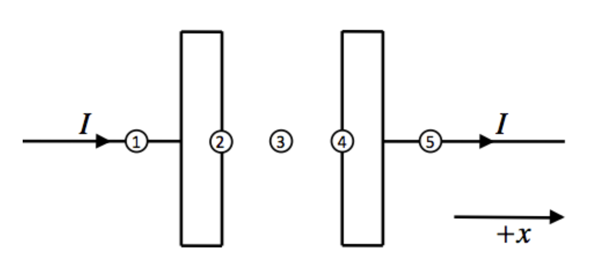

<section data-markdown>

Consider a large parallel plate capacitor as shown, charging so that $Q = Q_0+\beta t$ on the positively charged plate. Assuming the edges of the capacitor and the wire connections to the plates can be ignored, what is the direction of the magnetic field $\mathbf{B}$ halfway between the plates, at a radius $r$?

1. $\pm \hat{\phi}$
2. 0
3. $\pm \hat{z}$
4. $\pm \hat{s}$
5. ???

Note:
* Correct Answer: A

</section>

<section data-markdown>

Same capacitor with $Q = Q_0+\beta t$ on the positively charged plate. What is the direction of the magnetic field $\mathbf{B}$ halfway between the plates, at a radius $r$?

1. $+\hat{\phi}$
2. $-\hat{\phi}$
3. Not sure how to tell

Note:
* Correct Answer: A

</section>

<section data-markdown>

Same capacitor with $Q = Q_0+\beta t$ on the positively charged plate. What kind of amperian loop can be used between the plates to find the magnetic field $\mathbf{B}$ halfway between the plates, at a radius $r$?

D) A different loop  E) Not enough symmetry for a useful loop

Note:
* Correct Answer: B
</section>

<section data-markdown>

Same capacitor with $Q = Q_0+\beta t$ on the positively charged plate. What is the magnitude of the magnetic field $\mathbf{B}$ halfway between the plates, at a radius $r$?

1. $\frac{\mu_0 \beta}{2 \pi r}$
2. $\frac{\mu_0 \beta r}{2 d^2}$
3. $\frac{\mu_0 \beta d}{2 a^2}$
4. $\frac{\mu_0 \beta a}{2 \pi r^2}$
5. None of the above

Note:
* Correct Answer: E

</section>

<section data-markdown>

Consider the surface of an imaginary volume (dashed lines, at right) that partly encloses the left capacitor plate. For this closed surface, is the total flux of the current density, $\iint \mathbf{J} \cdot d\mathbf{A}$ positive, negative or zero?

1. Positive
2. Negative
3. Zero

Note:
* Correct Answer: B
* The charge density is increasing, so the total charge in the region is increasing with time, thus the flux of the current density must be negative (conservation of charge).
</section>

<section data-markdown>

At each location, we will evaluate the sign of $\partial \rho/\partial t$ and $\nabla \cdot \mathbf{J}$.

At location 1, the signs of $\partial \rho/\partial t$ and $\nabla \cdot \mathbf{J}$ are:
1. both zero
2. both negative
3. both positive
4. $\partial \rho/\partial t$ is positive and $\nabla \cdot \mathbf{J}$ is negative
5. $\partial \rho/\partial t$ is negative and $\nabla \cdot \mathbf{J}$ is positive

*Recall that charge is conserved locally!*

</section>

<section data-markdown>

At each location, we will evaluate the sign of $\partial \rho/\partial t$ and $\nabla \cdot \mathbf{J}$.

At location 2, the signs of $\partial \rho/\partial t$ and $\nabla \cdot \mathbf{J}$ are:
1. both zero
2. both negative
3. both positive
4. $\partial \rho/\partial t$ is positive and $\nabla \cdot \mathbf{J}$ is negative
5. $\partial \rho/\partial t$ is negative and $\nabla \cdot \mathbf{J}$ is positive

*Recall that charge is conserved locally!*

</section>

<section data-markdown>

At each location, we will evaluate the sign of $\partial \rho/\partial t$ and $\nabla \cdot \mathbf{J}$.

At location 3, the signs of $\partial \rho/\partial t$ and $\nabla \cdot \mathbf{J}$ are:
1. both zero
2. both negative
3. both positive
4. $\partial \rho/\partial t$ is positive and $\nabla \cdot \mathbf{J}$ is negative
5. $\partial \rho/\partial t$ is negative and $\nabla \cdot \mathbf{J}$ is positive

*Recall that charge is conserved locally!*

</section>

<section data-markdown>

At each location, we will evaluate the sign of $\partial \rho/\partial t$ and $\nabla \cdot \mathbf{J}$.

At location 4, the signs of $\partial \rho/\partial t$ and $\nabla \cdot \mathbf{J}$ are:
1. both zero
2. both negative
3. both positive
4. $\partial \rho/\partial t$ is positive and $\nabla \cdot \mathbf{J}$ is negative
5. $\partial \rho/\partial t$ is negative and $\nabla \cdot \mathbf{J}$ is positive

*Recall that charge is conserved locally!*

</section>

<section data-markdown>

At each location, we will evaluate the sign of $\partial \rho/\partial t$ and $\nabla \cdot \mathbf{J}$.

At location 5, the signs of $\partial \rho/\partial t$ and $\nabla \cdot \mathbf{J}$ are:
1. both zero
2. both negative
3. both positive
4. $\partial \rho/\partial t$ is positive and $\nabla \cdot \mathbf{J}$ is negative
5. $\partial \rho/\partial t$ is negative and $\nabla \cdot \mathbf{J}$ is positive

*Recall that charge is conserved locally!*

</section>
