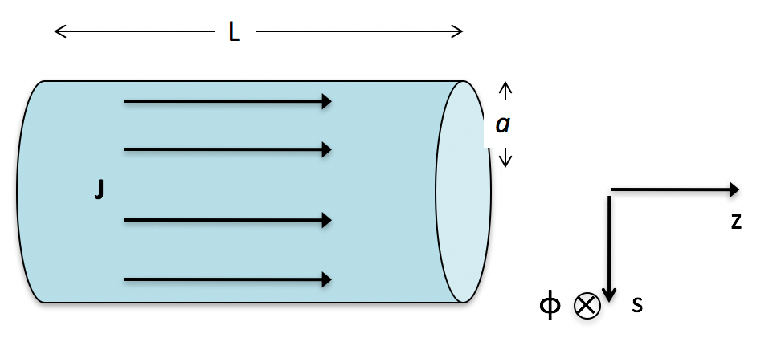
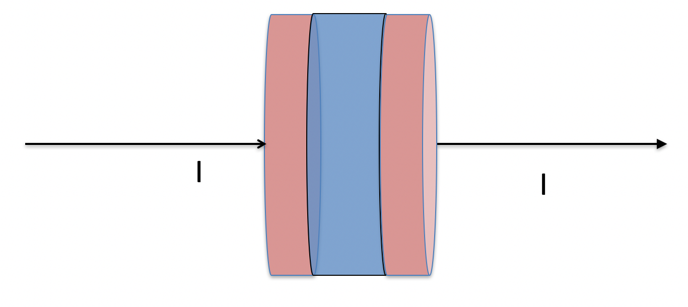

<section data-markdown>

Consider a current $I$ flowing through a cylindrical resistor of length $L$ and radius $a$ with voltage $V$ applied. What is the E field inside the resistor?

1. $(V/a) \hat{z}$
2. $(V/a) \hat{\phi}$
3. $(V/a) \hat{s}$
4. $(Vs/a^2) \hat{z}$
5. None of the above

Note:
* Correct Answer: A
</section>

<section data-markdown>
Consider a current $I$ flowing through a cylindrical resistor of length $L$ and radius $a$ with voltage $V$ applied. What is the B field inside the resistor?

1. $(I\mu_0/2\pi s) \hat{\phi}$
2. $(I\mu_0s/2\pi a^2)  \hat{\phi}$
3. $(I\mu_0/2\pi a)  \hat{\phi}$
4. $-(I\mu_0/2\pi a)  \hat{\phi}$
5. None of the above

Note:
* Correct Answer: B

</section>

<section data-markdown>

Consider a current $I$ flowing through a cylindrical resistor of length $L$ and radius $a$ with voltage $V$ applied.
What is the direction of the $\mathbf{S}$ vector on the outer curved surface of the resistor?

1. $\pm \hat{\phi}$
2. $\pm \hat{s}$
3. $\pm \hat{z}$
4. ???

Note:
* Correct Answer: B
</section>

<section data-markdown>

Consider the cylindrical volume of space bounded by the capacitor plates.  Compute $\mathbf{S} = \mathbf{E} \times \mathbf{B} /\mu_0$  at the outside (cylindrical, curved) surface of that volume.
Which WAY does it point?

1. Always inward
2. Always outward
3. ???

Note:
* Correct Answer: A
</section>

<section data-markdown>

The energies stored in the electric and magnetic fields are:

1. individually conserved for both $\mathbf{E}$ and $\mathbf{B}$, and cannot change.
2. conserved only if you sum the $\mathbf{E}$ and $\mathbf{B}$ energies together.
3. are not conserved at all.
4. ???

Note:
* Correct Answer: C

</section>
